# Codebase Walkthrough

> Full end-to-end walkthrough of the AI Post-Discharge Wound Monitoring system.

---

## Architecture Overview

```
┌─────────────────────────┐     ┌──────────────────────────────────────────────────┐
│   Frontend (React/Vite) │────▶│            Backend (FastAPI)                      │
│   :5173                 │     │            :8000                                  │
│                         │     │                                                  │
│  PatientHome            │     │  /api/patients    → DynamoDB (patients)          │
│  PhotoUpload            │     │  /api/assessments → S3 + YOLO + Bedrock + SNS   │
│  HealingTimeline        │     │  /api/voice       → Vapi (voice calls)          │
│  Dashboard              │     │  /api/health      → health check                │
└─────────────────────────┘     └──────────────────────────────────────────────────┘
                                     │         │          │          │          │
                                ┌────┘    ┌────┘    ┌─────┘    ┌─────┘    ┌────┘
                                ▼         ▼         ▼          ▼          ▼
                            DynamoDB   Amazon S3  Bedrock   Amazon SNS  Vapi
                           (patients, (wound-     (Claude   (clinician  (outbound
                           assessments) photos)   vision)    alerts)    voice calls)
```

### Assessment Pipeline & Voice Call Flow

```mermaid
sequenceDiagram
    participant App as Patient App
    participant API as FastAPI
    participant S3 as Amazon S3
    participant YOLO as YOLOv8
    participant DB as DynamoDB
    participant AI as Bedrock Claude
    participant SNS as Amazon SNS
    participant Voice as Vapi

    rect rgb(40, 40, 60)
    Note over App, SNS: Wound Assessment Pipeline
    App->>API: POST /api/assessments/upload (photo + patient_id)
    API->>S3: Store wound photo
    API->>YOLO: Detect wound + crop best bounding box
    API->>DB: Fetch previous 5 assessments (score history)
    API->>AI: Cropped image + patient context + previous scores
    AI-->>API: healing_score, tissue_types, anomalies, urgency, voice_agent_script
    API->>DB: Store full assessment (incl. voice_agent_script)
    opt urgency_level == "high"
        API->>SNS: Publish clinician alert (patient details + anomalies)
    end
    API-->>App: AssessmentResult JSON
    end

    rect rgb(40, 60, 40)
    Note over App, Voice: Voice Agent Flow
    App->>API: POST /api/voice/call (patient_id)
    API->>DB: Get patient (incl. language_preference) + latest assessment
    Note right of API: Use Bedrock voice_agent_script if available, else build fallback
    API->>Voice: Outbound call (script + language + dynamic variables)
    Voice-->>App: Patient receives phone call in their language
    end
```



---

## Backend (`backend/app/`)

**Stack:** Python 3.10+ · FastAPI · Pydantic v2 · Boto3 · YOLOv8 · Pillow · Mangum (Lambda)

### Entry Point — `main.py`

- Creates `FastAPI` app with CORS middleware (origins from `.env`)
- Mounts three routers:
  - `/api/patients` → `routers/patients.py`
  - `/api/assessments` → `routers/assessments.py`
  - `/api/voice` → `routers/voice.py`
- Health check at `GET /api/health` and root `GET /`

### Configuration — `config.py`

Uses `pydantic-settings` to load from `.env`:

| Variable                                      | Default                                     | Purpose                                    |
| --------------------------------------------- | ------------------------------------------- | ------------------------------------------ |
| `AWS_ACCESS_KEY_ID` / `AWS_SECRET_ACCESS_KEY` | —                                           | AWS credentials                            |
| `AWS_REGION`                                  | `ap-south-1`                                | AWS region (Mumbai)                        |
| `S3_BUCKET_NAME`                              | `wound-photos`                              | S3 bucket for images                       |
| `DYNAMODB_PATIENTS_TABLE`                     | `patients`                                  | DynamoDB table name                        |
| `DYNAMODB_ASSESSMENTS_TABLE`                  | `assessments`                               | DynamoDB table name                        |
| `BEDROCK_MODEL_ID`                            | `anthropic.claude-sonnet-4-5-20250929-v1:0` | Bedrock model                              |
| `YOLO_MODEL_PATH`                             | `yolov8n.pt`                                | Path to YOLO weights                       |
| `VAPI_API_KEY`                                | —                                           | Vapi private API key for voice calls       |
| `VAPI_ASSISTANT_ID`                           | —                                           | Vapi voice assistant ID                    |
| `VAPI_PHONE_NUMBER_ID`                        | —                                           | Vapi phone number ID (BYO SIP trunk)       |
| `SNS_ALERT_TOPIC_ARN`                         | —                                           | SNS topic ARN for clinician urgency alerts |
| `CORS_ORIGINS`                                | `http://localhost:5173`                     | Allowed origins                            |

---

### Models — `models/schemas.py`

#### Patient schemas

| Schema          | Fields                                                                                                  | Usage                                     |
| --------------- | ------------------------------------------------------------------------------------------------------- | ----------------------------------------- |
| `PatientCreate` | name, age, gender, phone, surgery_type, surgery_date, wound_location, risk_factors, language_preference | Request body for `POST /api/patients`     |
| `Patient`       | All of above + `patient_id`, `created_at`                                                               | Response model                            |
| `PatientUpdate` | All fields optional                                                                                     | Request body for `PUT /api/patients/{id}` |

#### Assessment schemas

| Schema             | Fields                                                                                                                                                                                                                     | Usage                         |
| ------------------ | -------------------------------------------------------------------------------------------------------------------------------------------------------------------------------------------------------------------------- | ----------------------------- |
| `BoundingBox`      | xmin, ymin, xmax, ymax, confidence, label                                                                                                                                                                                  | YOLO detection output         |
| `YoloResult`       | detections[], has_wound                                                                                                                                                                                                    | Aggregated YOLO output        |
| `PWATScores`       | 8 sub-scores (size, depth, necrotic tissue, granulation, edges, skin viability) + total                                                                                                                                    | Wound scoring rubric (max 32) |
| `AssessmentResult` | assessment_id, patient_id, image_url, yolo_detections, healing_score (0-10), pwat_scores, infection_status, tissue_types, anomalies, urgency_level, summary, recommendations, voice_agent_script, days_post_op, created_at | Full assessment response      |

#### Voice schemas

| Schema              | Fields                                       | Usage                      |
| ------------------- | -------------------------------------------- | -------------------------- |
| `VoiceCallRequest`  | patient_id                                   | Request body               |
| `VoiceCallResponse` | conversation_id, patient_id, status, message | Response with voice script |

---

### Routers

#### `routers/patients.py` — Patient CRUD

| Method   | Path                 | What it does                                             |
| -------- | -------------------- | -------------------------------------------------------- |
| `POST`   | `/api/patients`      | Creates patient with UUID, stores in DynamoDB            |
| `GET`    | `/api/patients`      | Lists all patients (DynamoDB scan)                       |
| `GET`    | `/api/patients/{id}` | Gets single patient, 404 if missing                      |
| `PUT`    | `/api/patients/{id}` | Partial update (only non-null fields via `exclude_none`) |
| `DELETE` | `/api/patients/{id}` | Deletes patient, 404 if missing                          |

#### `routers/assessments.py` — Wound Assessment Pipeline

| Method   | Path                            | What it does                                             |
| -------- | ------------------------------- | -------------------------------------------------------- |
| `POST`   | `/api/assessments/upload`       | **Full pipeline** (see below)                            |
| `GET`    | `/api/assessments/{patient_id}` | Lists all assessments for a patient, sorted by date desc |
| `GET`    | `/api/assessments/detail/{id}`  | Gets single assessment                                   |
| `DELETE` | `/api/assessments/detail/{id}`  | Deletes assessment                                       |

**Upload pipeline (`POST /upload`):**

```
1. Validate patient exists in DynamoDB
2. Read uploaded file bytes (reject if empty)
3. Upload original image to S3 (wounds/{patient_id}/{filename})
4. Generate presigned URL for the image
5. Run YOLO detection → get bounding boxes + cropped image
6. Fetch up to 5 previous assessments for trend context (score history)
7. Build patient context (age, surgery date, days post-op, risk factors)
8. Send cropped image + context + previous scores to Bedrock Claude → get structured assessment
9. Build assessment record (incl. voice_agent_script from Bedrock)
10. Convert floats to Decimals (DynamoDB requirement)
11. Store in DynamoDB
12. If urgency_level == "high" → publish clinician alert via SNS
13. Return AssessmentResult
```

Includes `Decimal↔float` converters since DynamoDB returns `Decimal` objects that break JSON serialization.

#### `routers/voice.py` — Voice Agent

| Method | Path              | What it does                                                                                                                                                                                                                                                                                                                                                                                                           |
| ------ | ----------------- | ---------------------------------------------------------------------------------------------------------------------------------------------------------------------------------------------------------------------------------------------------------------------------------------------------------------------------------------------------------------------------------------------------------------------- |
| `POST` | `/api/voice/call` | Fetches patient + latest assessment. Uses the **Bedrock-generated `voice_agent_script`** stored in the assessment (falling back to a manually built script if absent). Passes the patient's `language_preference` and dynamic variables to Vapi. Triggers a live outbound phone call via the Vapi API (`POST https://api.vapi.ai/call/phone`). Falls back to a simulated response if API keys are missing. |

---

### Services

#### `services/dynamodb.py`

Manages all DynamoDB operations for both tables. Key patterns:

- **Pagination:** All `scan()` calls handle `LastEvaluatedKey` to avoid losing data past 1MB
- **Dynamic UpdateExpression:** Builds `SET #k0 = :v0, #k1 = :v1` dynamically from update dict, uses aliases to avoid reserved-word conflicts
- **Assessments by patient:** Uses `scan + FilterExpression` (works at hackathon scale; comment notes GSI upgrade path)
- **Error handling:** Every function wrapped in `try/except ClientError` with structured logging

Functions: `put_patient`, `get_patient`, `get_all_patients`, `update_patient`, `delete_patient`, `put_assessment`, `get_assessments_by_patient`, `get_assessment`, `delete_assessment`

#### `services/s3.py`

- `upload_image(bytes, patient_id, filename)` → stores at `wounds/{patient_id}/{filename}`
- `get_presigned_url(key)` → 1-hour expiry signed GET URL
- `download_image(key)` → returns raw bytes

#### `services/yolo.py`

- **Lazy loading:** Model loaded once on first call, cached globally
- `detect_wound(image_bytes)` → opens image with PIL, runs YOLOv8, extracts all bounding boxes, crops the highest-confidence detection with 10% padding
- Returns: `{ detections: [...], cropped_image_bytes: bytes|None, has_wound: bool }`

#### `services/bedrock.py`

- `assess_wound(image_bytes, patient_context, previous_scores=None)` → calls Claude via `bedrock-runtime`
- **System prompt** constrains output to exact JSON schema (healing_score, pwat_scores, tissue_types, anomalies, urgency_level, summary, recommendations, voice_agent_script)
- Sends multimodal message: base64-encoded image + text with patient context
- When `previous_scores` is provided, appends the last 5 healing scores with day numbers to the prompt for trend-aware analysis
- Strips accidental markdown fencing from response before JSON parsing

#### `services/sns.py`

- `publish_urgency_alert(patient, assessment)` → publishes a structured JSON message to an SNS topic when urgency is high
- Includes patient name, phone, surgery type, wound location, healing score, anomalies, and summary
- **Graceful degradation:** skips silently if `SNS_ALERT_TOPIC_ARN` is not configured; logs error but does not block the pipeline on publish failure
- Lazy-initialised boto3 SNS client (same pattern as S3 and DynamoDB services)

### Utils — `utils/helpers.py`

- `days_since(date_str)` — parses ISO date, returns days elapsed from today
- `format_phone_e164(phone)` — strips formatting, prepends `+91` if missing

---

### Error Handling Strategy

| Layer    | Exception      | HTTP Code | Meaning                                          |
| -------- | -------------- | --------- | ------------------------------------------------ |
| Services | `ClientError`  | —         | Logged with context, re-raised to router         |
| Services | `ValueError`   | —         | Bad input (invalid image, bad JSON from Bedrock) |
| Services | `RuntimeError` | —         | Service failure (YOLO model won't load)          |
| Routers  | `ClientError`  | **502**   | Upstream AWS service error                       |
| Routers  | `ValueError`   | **400**   | Bad request (invalid image, empty file)          |
| Routers  | `RuntimeError` | **503**   | Service unavailable (YOLO down)                  |
| Routers  | Not found      | **404**   | Patient or assessment doesn't exist              |

---

## Frontend (`frontend/src/`)

**Stack:** React 19 · Vite 7 · React Router v7 · Axios · Lucide React · React Hot Toast

### Routing — `App.jsx`

All routes wrapped in `Layout` (provides bottom nav bar):

| Route        | Component         | Purpose                             |
| ------------ | ----------------- | ----------------------------------- |
| `/`          | `PatientHome`     | Patient landing page                |
| `/upload`    | `PhotoUpload`     | Camera/file upload for wound photos |
| `/timeline`  | `HealingTimeline` | Visual history of healing progress  |
| `/dashboard` | `Dashboard`       | Clinician overview of all patients  |

### Layout — `components/Layout.jsx`

- Bottom navigation bar with 4 tabs: Home, Upload, Timeline, Dashboard
- Uses Lucide icons (`Home`, `Camera`, `Activity`, `LayoutDashboard`)
- Active tab highlighting via `NavLink`
- Global toast notifications via `react-hot-toast`

### API Layer — `services/api.js`

Axios instance with `baseURL: '/api'` and 30s timeout:

| Function                            | Endpoint                       | Notes                      |
| ----------------------------------- | ------------------------------ | -------------------------- |
| `createPatient(data)`               | `POST /patients`               |                            |
| `getPatients()`                     | `GET /patients`                |                            |
| `getPatient(id)`                    | `GET /patients/{id}`           |                            |
| `updatePatient(id, data)`           | `PUT /patients/{id}`           |                            |
| `uploadWoundPhoto(patientId, file)` | `POST /assessments/upload`     | Uses `multipart/form-data` |
| `getAssessments(patientId)`         | `GET /assessments/{patientId}` |                            |
| `getAssessment(id)`                 | `GET /assessments/detail/{id}` |                            |
| `triggerVoiceCall(patientId)`       | `POST /voice/call`             |                            |
| `healthCheck()`                     | `GET /health`                  |                            |

### Vite Config — `vite.config.js`

Proxies `/api` requests to `http://localhost:8000` during development to avoid CORS issues.

---

## AWS Resources Required

| Service        | Resource                                   | Config                                           |
| -------------- | ------------------------------------------ | ------------------------------------------------ |
| **S3**         | Bucket: `wound-photos`                     | Stores wound images under `wounds/{patient_id}/` |
| **DynamoDB**   | Table: `patients` (PK: `patient_id`)       | Patient records                                  |
| **DynamoDB**   | Table: `assessments` (PK: `assessment_id`) | Assessment results                               |
| **Bedrock**    | Model: Claude Sonnet                       | Multimodal wound assessment                      |
| **SNS**        | Topic: `wound-urgency-alerts`              | Clinician alerts on high-urgency assessments     |
| **Vapi**         | Voice AI Agent (BYO SIP trunk)             | Voice call platform (outbound calls to patients) |

> **Note:** For production, add a Global Secondary Index on `patient_id` in the assessments table to replace the current scan+filter approach.

---

## Running Locally

```bash
# Backend
cd backend
python -m venv venv
source venv/bin/activate      # Windows: venv\Scripts\activate
pip install -r requirements.txt
cp .env.example .env          # Fill in AWS credentials
uvicorn app.main:app --reload # → http://localhost:8000/docs

# Frontend
cd frontend
npm install
npm run dev                   # → http://localhost:5173
```

---

## Deployment

`mangum` is included in `requirements.txt` for AWS Lambda deployment. To deploy:

1. Add `handler = Mangum(app)` to `main.py`
2. Package with dependencies
3. Deploy behind API Gateway
