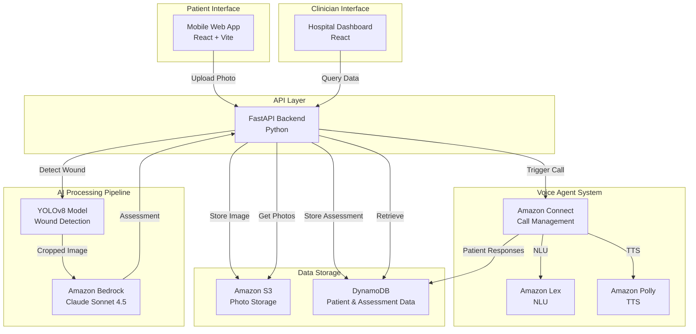

# Design Document: AI-Powered Post-Discharge Wound Monitoring System

## Overview

The AI-powered post-discharge wound monitoring system is a healthcare application that enables continuous remote monitoring of surgical wound healing for high-risk patients in India. The system combines computer vision (YOLOv8), large language models (Amazon Bedrock with Claude), and conversational AI (Amazon Connect) to provide automated wound assessment and proactive patient engagement.

### Key Design Goals

1. **Accessibility**: Enable patients with limited healthcare access to receive expert-level wound monitoring through smartphone photos
2. **Early Detection**: Identify wound complications early through AI-powered analysis to prevent hospital readmissions
3. **Scalability**: Support monitoring of hundreds of patients simultaneously with minimal clinician overhead
4. **User Experience**: Provide simple, mobile-friendly interfaces for patients and efficient dashboards for clinicians
5. **Clinical Accuracy**: Generate reliable wound assessments that align with established wound care protocols (PWAT scoring)

### Technology Stack

- **Frontend**: React 18 + Vite, mobile-responsive web application
- **Backend**: Python 3.10+ with FastAPI framework
- **Computer Vision**: YOLOv8 (Ultralytics) for wound detection and segmentation
- **AI Assessment**: Amazon Bedrock with Claude Sonnet 4.5 for tissue analysis and natural language generation
- **Voice Agent**: Amazon Connect + Amazon Lex + Amazon Polly for conversational patient interaction
- **Storage**: Amazon S3 for photo storage, DynamoDB for patient and assessment data
- **Infrastructure**: AWS cloud services (ap-south-1 region for India deployment)

## Architecture

### System Architecture Diagram



### Request Flow: Photo Upload to Assessment

1. **Photo Upload**: Patient captures/selects wound photo in mobile web app
2. **Validation**: Frontend validates image format, size, and basic quality
3. **Upload to S3**: Backend receives photo, generates unique ID, uploads to S3 with patient metadata
4. **Wound Detection**: YOLOv8 model processes image, detects wound region, generates bounding box and segmentation mask
5. **Cropping**: System extracts wound region with 20% padding for context
6. **AI Assessment**: Cropped image + patient context sent to Bedrock Claude model
7. **Structured Analysis**: Claude analyzes tissue composition, generates PWAT scores, healing score (0-10 scale), infection status, and natural language summary
8. **Storage**: Complete assessment stored in DynamoDB with references to original and cropped images
9. **Voice Call Trigger**: System schedules voice agent call based on patient preferences and assessment urgency
10. **Patient Notification**: Patient receives confirmation and estimated call time

### Request Flow: Voice Agent Interaction

1. **Call Initiation**: Amazon Connect initiates outbound call to patient phone number
2. **Greeting**: Voice agent (Polly TTS) greets patient by name in preferred language
3. **Assessment Summary**: Agent communicates healing score and key findings in simple terms
4. **Interactive Q&A**: Patient asks questions, Lex interprets intent, agent provides contextual responses
5. **Follow-up Questions**: Agent asks standardized questions (pain level, discharge, fever)
6. **Escalation Check**: If patient responses indicate concern, agent offers clinician callback
7. **Transcript Storage**: Complete conversation transcript and patient responses stored in DynamoDB
8. **Next Steps**: Agent confirms next photo upload date and warning signs to monitor

### Escalation Flow

1. **Trigger Detection**: System identifies escalation trigger (low healing score, infection signs, patient-reported symptoms)
2. **Urgency Classification**: Escalation classified as Critical, High, or Medium based on severity
3. **Notification**: Real-time notification sent to assigned clinician via dashboard
4. **Clinician Review**: Clinician accesses patient record, reviews photos, assessments, and voice transcripts
5. **Action**: Clinician marks escalation status, adds clinical notes, schedules follow-up or intervention
6. **Patient Communication**: System sends SMS to patient with clinician instructions or callback information

## Components and Interfaces

### Frontend Components

#### 1. Mobile Web Application (Patient Interface)

**Technology**: React 18, Vite, Axios for API calls

**Key Pages**:
- **Patient Home**: Dashboard showing latest healing score, next upload date, recent assessments
- **Photo Upload**: Camera capture or file selection with real-time validation feedback
- **Healing Timeline**: Chronological view of all assessments with score chart and photo gallery
- **Assessment Detail**: Individual assessment view with photo, tissue analysis, recommendations

**Responsive Design**: Mobile-first design optimized for smartphones (320px-428px width), works on tablets and desktop

**State Management**: React Context API for patient authentication state and assessment data caching

**Photo Capture**: Uses browser MediaDevices API for camera access, falls back to file input

#### 2. Hospital Dashboard (Clinician Interface)

**Technology**: React 18, Vite, Material-UI components

**Key Features**:
- **Patient List**: Sortable/filterable table of all assigned patients with status indicators
- **Escalation Queue**: Prioritized list of patients requiring immediate attention
- **Patient Detail View**: Comprehensive patient record with timeline, photos, and voice transcripts
- **Analytics**: Summary statistics and trends across patient population
- **Clinical Notes**: Interface for adding notes to assessments

**Access Control**: Clinician authentication required, role-based access to patient data

### Backend Components

#### 1. FastAPI Application

**Structure**:
- **Routers**: Separate routers for patients, assessments, voice agent endpoints
- **Services**: Modular services for S3, DynamoDB, Bedrock, YOLO, voice agent integration
- **Models**: Pydantic schemas for request/response validation
- **Middleware**: CORS configuration, error handling, request logging

**API Endpoints**:

**Patient Management**:
- `POST /api/patients` - Create new patient profile
- `GET /api/patients` - List all patients (clinician only)
- `GET /api/patients/{patient_id}` - Get patient details
- `PUT /api/patients/{patient_id}` - Update patient profile

**Assessment Management**:
- `POST /api/assessments/upload` - Upload photo and trigger assessment
- `GET /api/assessments/{patient_id}` - Get all assessments for patient
- `GET /api/assessments/detail/{assessment_id}` - Get specific assessment

**Voice Agent**:
- `POST /api/voice/initiate-call` - Trigger outbound call to patient
- `POST /api/voice/webhook` - Receive callbacks from Amazon Connect
- `GET /api/voice/transcript/{patient_id}` - Get voice interaction history

**Health Check**:
- `GET /api/health` - Service health status

#### 2. YOLOv8 Wound Detection Service

**Model**: YOLOv8n (nano) or YOLOv8s (small) trained on DFUC (Diabetic Foot Ulcer Challenge) dataset

**Input**: Raw wound photo (JPEG/PNG, up to 5MB)

**Processing**:
1. Load image into PIL Image object
2. Run YOLO inference with confidence threshold 0.6
3. Extract bounding boxes for detected wounds
4. Select primary wound (largest area if multiple detections)
5. Generate segmentation mask for wound region
6. Crop wound region with 20% padding on all sides
7. Return bounding box coordinates, confidence score, and cropped image bytes

**Output**:
```python
{
    "detections": [
        {
            "xmin": 120.5,
            "ymin": 200.3,
            "xmax": 450.8,
            "ymax": 520.1,
            "confidence": 0.87,
            "label": "wound"
        }
    ],
    "has_wound": True,
    "cropped_image_bytes": <bytes>
}
```

**Error Handling**:
- No wound detected (confidence < 0.6): Flag for manual review
- Multiple wounds: Select largest, log for clinician review
- Model loading failure: Retry with exponential backoff, fallback to full image analysis

#### 3. Amazon Bedrock Assessment Service

**Model**: Claude Sonnet 4.5 (anthropic.claude-sonnet-4-5-20250929-v1:0)

**Input**:
- Cropped wound image (base64 encoded)
- Patient context: age, diabetes status, surgery type, days post-op, previous healing scores

**Prompt Structure**:
```
System: You are a wound care specialist AI. Analyze the wound image and patient context to provide a structured assessment. Output must be valid JSON.

User: [Image] + Patient context: {age: 68, diabetes: true, surgery_type: "knee replacement", days_post_op: 14, previous_scores: [6.2, 6.8]}

Analyze the wound and provide:
1. PWAT scores (size, depth, necrotic tissue type/amount, granulation tissue type/amount, edges, periulcer skin viability)
2. Healing score (0-10 scale)
3. Infection status (none/infection/ischemia/both)
4. Tissue types present (granulation, epithelialization, slough, necrosis, fibrin)
5. Anomalies detected
6. Urgency level (low/medium/high)
7. Summary (2-3 sentences in simple language)
8. Recommendations (3-5 actionable items)
9. Voice agent script (conversational summary for phone call)
```

**Output**:
```json
{
    "healing_score": 6.5,
    "pwat_scores": {
        "size": 2,
        "depth": 2,
        "necrotic_tissue_type": 1,
        "necrotic_tissue_amount": 1,
        "granulation_tissue_type": 3,
        "granulation_tissue_amount": 3,
        "edges": 2,
        "periulcer_skin_viability": 1,
        "total_score": 15
    },
    "infection_status": "none",
    "tissue_types": ["granulation", "epithelialization"],
    "anomalies": [],
    "urgency_level": "low",
    "summary": "Your wound is healing well. We can see healthy pink tissue forming, which is a good sign. The wound edges are starting to close.",
    "recommendations": [
        "Continue current wound care routine",
        "Keep the area clean and dry",
        "Take photos every 3 days",
        "Watch for increased redness or discharge"
    ],
    "voice_agent_script": "Hello! I'm calling about your recent wound photo. Good news - your healing score is 6.5 out of 10, which shows steady progress. We can see healthy tissue forming and the wound is closing nicely. Keep up your current care routine."
}
```

**Healing Score Calculation Logic**:
- Base score from PWAT total (0-32 scale normalized to 0-10)
- Adjustments: +0.5 for granulation tissue presence, -1.0 for infection signs, -0.5 for necrotic tissue >10%
- Trend adjustment: +0.3 if improving from previous score, -0.3 if declining
- Final score clamped to 0-10 range

**Error Handling**:
- Bedrock API timeout: Retry up to 3 times with exponential backoff
- Invalid JSON response: Parse with error recovery, use default values for missing fields
- Rate limiting: Queue request for later processing, notify patient of delay

#### 4. Amazon Connect Voice Agent Integration

**Architecture**:
- **Amazon Connect**: Manages call flow, outbound dialing, call routing
- **Amazon Lex**: Natural language understanding for patient questions
- **Amazon Polly**: Text-to-speech for agent responses
- **Lambda Functions**: Process Lex intents, retrieve assessment data, update DynamoDB

**Call Flow Design**:

1. **Initiation**: Backend triggers Connect API to start outbound call
2. **Greeting Block**: "Hello [Patient Name], this is the wound monitoring assistant calling about your recent wound photo."
3. **Assessment Summary Block**: Read voice_agent_script from assessment
4. **Question Loop Block**: 
   - "Do you have any questions about your wound?"
   - If yes: Route to Lex bot for Q&A
   - If no: Proceed to follow-up questions
5. **Follow-up Questions Block**:
   - "On a scale of 0 to 10, how would you rate your pain level?"
   - "Have you noticed any discharge or fluid from the wound?"
   - "Have you had any fever in the last 24 hours?"
6. **Escalation Check Block**: If pain >7 or fever reported, offer clinician callback
7. **Closing Block**: "Your next photo is due in 3 days. Watch for increased redness, swelling, or foul odor. Thank you!"

**Lex Bot Intents**:
- **WoundStatusIntent**: "How is my wound doing?" → Provide healing score and summary
- **PainManagementIntent**: "What should I do about pain?" → Provide pain management guidance
- **InfectionConcernIntent**: "Is my wound infected?" → Explain infection signs, offer escalation
- **NextStepsIntent**: "What should I do next?" → Provide recommendations from assessment
- **SpeakToHumanIntent**: "I want to talk to a doctor" → Trigger escalation, provide callback info

**Language Support**:
- Hindi (hi-IN): Polly voice "Aditi"
- English (en-IN): Polly voice "Raveena"
- Language selected based on patient profile preference

**Call Recording**: All calls recorded and stored in S3 for compliance and quality assurance

#### 5. Data Storage Services

**Amazon S3 Structure**:
```
wound-photos/
├── patients/
│   └── {patient_id}/
│       └── {assessment_id}/
│           ├── original.jpg
│           ├── cropped.jpg
│           └── segmentation_mask.png
└── voice-recordings/
    └── {patient_id}/
        └── {call_id}.wav
```

**S3 Configuration**:
- Encryption: AES-256 server-side encryption
- Lifecycle policy: Transition to Glacier after 30 days, delete after 90 days (unless marked for retention)
- Versioning: Disabled (immutable photos)
- Access: Pre-signed URLs with 1-hour expiration for frontend access

**DynamoDB Tables**:

**patients Table**:
- Primary Key: `patient_id` (String)
- Attributes: name, age, gender, phone, surgery_type, surgery_date, wound_location, risk_factors, language_preference, created_at, monitoring_status
- GSI: `phone-index` for lookup by phone number

**assessments Table**:
- Primary Key: `assessment_id` (String)
- Sort Key: `created_at` (String, ISO 8601 timestamp)
- Attributes: patient_id, image_url, yolo_detections, healing_score, pwat_scores, infection_status, tissue_types, anomalies, urgency_level, summary, recommendations, days_post_op
- GSI: `patient_id-created_at-index` for querying patient's assessment history

**voice_interactions Table**:
- Primary Key: `interaction_id` (String)
- Attributes: patient_id, assessment_id, call_id, contact_id, call_status, transcript, patient_responses (pain_level, discharge_present, fever_present), escalation_triggered, created_at
- GSI: `patient_id-created_at-index` for patient interaction history

**escalations Table**:
- Primary Key: `escalation_id` (String)
- Attributes: patient_id, assessment_id, urgency_level, trigger_reason, status (pending/reviewed/action_taken), assigned_clinician, clinician_notes, created_at, resolved_at
- GSI: `status-urgency_level-index` for escalation queue sorting

## Data Models

### Patient Model

```python
class Patient:
    patient_id: str              # UUID
    name: str                    # Full name
    age: int                     # Age in years
    gender: str | None           # "M", "F", "Other", or None
    phone: str                   # Format: +91XXXXXXXXXX
    surgery_type: str            # e.g., "Knee Replacement", "Appendectomy"
    surgery_date: str            # ISO 8601 date: "2025-01-15"
    wound_location: str | None   # e.g., "Right Knee", "Abdomen"
    risk_factors: list[str]      # ["diabetes", "elderly", "obese", "smoker"]
    language_preference: str     # "hi-IN" or "en-IN"
    created_at: str              # ISO 8601 timestamp
    monitoring_status: str       # "active", "completed", "inactive"
```

**Validation Rules**:
- `phone`: Must match regex `^\+91[6-9]\d{9}$`
- `age`: Must be >= 18 and <= 120
- `surgery_date`: Must be <= current date
- `risk_factors`: Valid values: ["diabetes", "elderly", "obese", "smoker", "immunocompromised"]
- `language_preference`: Must be "hi-IN" or "en-IN"

### Assessment Model

```python
class Assessment:
    assessment_id: str                    # UUID
    patient_id: str                       # Foreign key to Patient
    image_url: str                        # S3 presigned URL
    cropped_image_url: str | None         # S3 presigned URL for cropped wound
    yolo_detections: list[BoundingBox]    # Wound detection results
    healing_score: float                  # 0.0 - 10.0
    pwat_scores: PWATScores               # Structured PWAT assessment
    infection_status: str                 # "none", "infection", "ischemia", "both"
    tissue_types: list[str]               # Tissue classifications
    anomalies: list[str]                  # Detected anomalies
    urgency_level: str                    # "low", "medium", "high"
    summary: str                          # Patient-friendly summary
    recommendations: list[str]            # Actionable recommendations
    voice_agent_script: str               # Script for voice call
    days_post_op: int                     # Days since surgery
    created_at: str                       # ISO 8601 timestamp
```

**Derived Fields**:
- `days_post_op`: Calculated as `(assessment_date - surgery_date).days`
- `urgency_level`: Determined by healing_score and infection_status
  - "high": healing_score < 4.0 OR infection_status != "none"
  - "medium": healing_score 4.0-6.0
  - "low": healing_score > 6.0

### PWAT Scores Model

```python
class PWATScores:
    size: int                          # 0-4 (0=healed, 4=>24cm²)
    depth: int                         # 0-4 (0=healed, 4=full thickness)
    necrotic_tissue_type: int          # 0-4 (0=none, 4=eschar)
    necrotic_tissue_amount: int        # 0-4 (0=none, 4=>75%)
    granulation_tissue_type: int       # 0-4 (0=none, 4=bright red)
    granulation_tissue_amount: int     # 0-4 (0=none, 4=>75%)
    edges: int                         # 0-4 (0=attached, 4=rolled under)
    periulcer_skin_viability: int      # 0-2 (0=healthy, 2=dark/hardened)
    total_score: int                   # Sum of all scores (0-32)
```

**Scoring Reference**: Based on Pressure Ulcer Scale for Healing (PUSH) and PWAT clinical standards

### Voice Interaction Model

```python
class VoiceInteraction:
    interaction_id: str           # UUID
    patient_id: str               # Foreign key to Patient
    assessment_id: str            # Foreign key to Assessment
    call_id: str                  # Amazon Connect contact ID
    call_status: str              # "answered", "missed", "voicemail", "failed"
    transcript: str               # Full conversation transcript
    patient_responses: dict       # Structured responses
        # {
        #     "pain_level": 3,
        #     "discharge_present": False,
        #     "fever_present": False,
        #     "additional_concerns": "Some itching around edges"
        # }
    escalation_triggered: bool    # Whether escalation was triggered during call
    duration_seconds: int         # Call duration
    created_at: str               # ISO 8601 timestamp
```

### Escalation Model

```python
class Escalation:
    escalation_id: str            # UUID
    patient_id: str               # Foreign key to Patient
    assessment_id: str            # Foreign key to Assessment
    urgency_level: str            # "critical", "high", "medium"
    trigger_reason: str           # Description of escalation trigger
    status: str                   # "pending", "reviewed", "action_taken", "resolved"
    assigned_clinician: str | None  # Clinician ID
    clinician_notes: str          # Clinical notes from review
    created_at: str               # ISO 8601 timestamp
    resolved_at: str | None       # ISO 8601 timestamp when resolved
```

**Urgency Level Determination**:
- **Critical**: infection_status != "none" AND (fever_present OR pain_level > 7)
- **High**: healing_score < 3.0 OR (infection_status != "none")
- **Medium**: healing_score 3.0-4.0 OR pain_level > 5

### Bounding Box Model

```python
class BoundingBox:
    xmin: float                   # Left edge (pixels)
    ymin: float                   # Top edge (pixels)
    xmax: float                   # Right edge (pixels)
    ymax: float                   # Bottom edge (pixels)
    confidence: float             # Detection confidence (0.0-1.0)
    label: str                    # "wound"
```

## Correctness Properties


*A property is a characteristic or behavior that should hold true across all valid executions of a system—essentially, a formal statement about what the system should do. Properties serve as the bridge between human-readable specifications and machine-verifiable correctness guarantees.*

### Photo Upload and Validation Properties

**Property 1: Photo validation correctness**
*For any* uploaded image file, the validation function should accept it if and only if it meets all quality standards (resolution ≥ 1024x768, file size ≤ 10MB, format JPEG/PNG)
**Validates: Requirements 1.2**

**Property 2: Photo upload persistence**
*For any* valid wound photo that passes validation, after successful upload, retrieving the photo from S3 using the returned photo_id should return the same image with correct metadata (patient_id, timestamp)
**Validates: Requirements 1.3**

**Property 3: Validation error specificity**
*For any* photo that fails validation, the error message should specifically identify the validation failure reason (resolution too low, file too large, invalid format, poor quality)
**Validates: Requirements 1.4**

**Property 4: Upload idempotency**
*For any* photo upload request, submitting the same request multiple times concurrently should result in exactly one assessment being created, not multiple duplicates
**Validates: Requirements 1.5**

**Property 5: Assessment workflow trigger**
*For any* successfully uploaded wound photo, an assessment record should be automatically created and linked to the photo within the system
**Validates: Requirements 1.6**

### Wound Detection Properties

**Property 6: Wound detection invocation**
*For any* uploaded wound photo, the YOLOv8 detection service should be invoked with the photo as input
**Validates: Requirements 2.1**

**Property 7: Segmentation mask generation**
*For any* wound photo where YOLO detects a wound with confidence ≥ 0.6, a segmentation mask should be generated and stored
**Validates: Requirements 2.2, 2.6**

**Property 8: Multiple wound region handling**
*For any* image where YOLO detects multiple wound regions, the system should select the region with the largest area as the primary wound
**Validates: Requirements 2.3**

**Property 9: Low confidence detection handling**
*For any* wound photo where YOLO's maximum detection confidence is < 0.6, the system should flag the photo for manual review and create a notification for the patient
**Validates: Requirements 2.4**

**Property 10: Bounding box data flow**
*For any* successful wound detection, the bounding box coordinates should be passed to the Bedrock assessment service as part of the analysis request
**Validates: Requirements 2.5**

### Tissue Analysis and Healing Score Properties

**Property 11: Tissue classification completeness**
*For any* detected wound region, the Bedrock service should return tissue classifications for all relevant tissue types (healthy, granulation, slough, necrotic, infection signs)
**Validates: Requirements 3.1**

**Property 12: Healing score range validity**
*For any* completed tissue analysis, the generated healing score should be a numeric value in the range [0, 10]
**Validates: Requirements 3.2**

**Property 13: Healing score calculation formula**
*For any* assessment with tissue analysis data, the healing score should be calculated using the weighted formula: (healthy_tissue_pct * 0.4) + (granulation_presence * 0.3) + (infection_absence * 0.2) + (size_reduction * 0.1), normalized to 0-10 scale
**Validates: Requirements 3.3**

**Property 14: Assessment classification by score**
*For any* healing score value, the assessment classification should be: "Poor - Requires Attention" if score < 4.0, "Fair - Monitor Closely" if 4.0 ≤ score ≤ 7.0, "Good - Healing Well" if score > 7.0
**Validates: Requirements 3.4, 3.5, 3.6**

**Property 15: Assessment data persistence**
*For any* completed wound assessment, the stored record in DynamoDB should contain all required fields: assessment_id, patient_id, timestamp, healing_score, tissue_analysis, pwat_scores, and summary
**Validates: Requirements 3.8**

### Voice Agent Interaction Properties

**Property 16: Voice call scheduling**
*For any* completed wound assessment, a voice agent call should be scheduled to the patient's registered phone number within 30 minutes of assessment completion
**Validates: Requirements 4.1**

**Property 17: Personalized greeting**
*For any* voice agent call, the greeting script should include the patient's name from their profile
**Validates: Requirements 4.2**

**Property 18: Assessment data in call script**
*For any* voice agent call, the call script should include the healing score and assessment summary from the associated assessment
**Validates: Requirements 4.3**

**Property 19: Language preference adherence**
*For any* voice agent call, the language used (Hindi or English) should match the language_preference field in the patient's profile
**Validates: Requirements 4.5**

**Property 20: Standardized follow-up questions**
*For any* voice agent call, the call script should include all standardized follow-up questions: pain level (0-10), discharge presence, odor presence, and fever symptoms
**Validates: Requirements 4.7**

**Property 21: Voice interaction persistence**
*For any* completed voice agent call, the transcript and patient responses should be stored in DynamoDB with the interaction_id, patient_id, and assessment_id
**Validates: Requirements 4.8**

**Property 22: Call closing completeness**
*For any* voice agent call, the closing script should include the next scheduled photo upload date and warning signs to monitor
**Validates: Requirements 4.9**

### Escalation Properties

**Property 23: Low score escalation trigger**
*For any* wound assessment with healing_score < 4.0, an escalation record should be automatically created with appropriate urgency level
**Validates: Requirements 5.1**

**Property 24: Infection-based escalation trigger**
*For any* wound assessment where tissue analysis detects infection signs (infection_status != "none") or necrotic tissue > 10%, an urgent escalation should be created regardless of healing score
**Validates: Requirements 5.2**

**Property 25: Patient-reported symptom escalation**
*For any* voice interaction where the patient reports fever > 38°C or pain level > 7, an urgent escalation should be created
**Validates: Requirements 5.3**

**Property 26: Escalation notification delivery**
*For any* created escalation, a notification should be sent to the assigned clinician's dashboard
**Validates: Requirements 5.4**

**Property 27: Escalation urgency prioritization**
*For any* escalation, the urgency level should be determined as: "critical" if (infection_status != "none" AND fever_present), "high" if healing_score < 3.0 OR infection_status != "none", "medium" if 3.0 ≤ healing_score < 4.0
**Validates: Requirements 5.5**

**Property 28: Escalation status transitions**
*For any* escalation, the status should be updatable to "reviewed", "action_taken", or "scheduled_follow_up", and the update should persist in DynamoDB
**Validates: Requirements 5.7**

**Property 29: Escalation action notification**
*For any* escalation where a clinician updates the status to "action_taken", an SMS notification should be sent to the patient
**Validates: Requirements 5.8**

### Healing Timeline Properties

**Property 30: Assessment chronological ordering**
*For any* patient with multiple assessments, retrieving the healing timeline should return assessments sorted by created_at timestamp in ascending order (oldest first)
**Validates: Requirements 6.1**

**Property 31: Timeline chart data structure**
*For any* patient with assessments, the generated chart data should contain arrays of dates and corresponding healing scores with matching indices
**Validates: Requirements 6.2**

**Property 32: Assessment detail completeness**
*For any* selected assessment in the timeline, the detail view should include the wound photo URL, tissue analysis, and AI summary
**Validates: Requirements 6.3**

**Property 33: Trend direction calculation**
*For any* patient with at least 2 assessments, the trend should be classified as "positive" if the latest healing score > previous score, "negative" if latest < previous, "stable" if equal
**Validates: Requirements 6.4**

**Property 34: Healing rate calculation**
*For any* patient with at least 2 assessments spanning multiple days, the average healing rate should be calculated as (latest_score - first_score) / (days_between / 7) to get score change per week
**Validates: Requirements 6.5**

**Property 35: Insufficient data messaging**
*For any* patient with fewer than 2 assessments, the timeline view should display an encouragement message for regular uploads
**Validates: Requirements 6.6**

### Hospital Dashboard Properties

**Property 36: Dashboard patient list completeness**
*For any* clinician accessing the dashboard, the patient list should include all assigned patients with their latest healing score and most recent assessment date
**Validates: Requirements 7.1**

**Property 37: Patient list priority sorting**
*For any* patient list on the dashboard, patients should be sorted by: escalations first (by urgency level), then by healing score (lowest first), then by days since last assessment (highest first)
**Validates: Requirements 7.2**

**Property 38: Patient profile completeness**
*For any* selected patient in the dashboard, the profile view should include all risk factors, surgery type, surgery date, age, and BMI
**Validates: Requirements 7.3**

**Property 39: Dashboard filter correctness**
*For any* applied filter on the dashboard ("Escalations Only", "High Risk Patients", "Overdue Assessments"), the returned patient list should contain only patients matching the filter criteria
**Validates: Requirements 7.4**

**Property 40: Dashboard statistics accuracy**
*For any* dashboard view, the summary statistics (total patients, active escalations, average healing score) should be calculated correctly from the current patient and assessment data
**Validates: Requirements 7.5**

**Property 41: Clinical notes access control**
*For any* clinical note added to an assessment, the note should be visible to all clinicians but not accessible through patient-facing API endpoints
**Validates: Requirements 7.7**

**Property 42: Patient data export completeness**
*For any* patient data export request, the generated PDF should include the patient profile, all assessments with healing scores, and all wound photos
**Validates: Requirements 7.8**

### Patient Registration Properties

**Property 43: Registration data completeness**
*For any* patient registration request, the system should require and validate all mandatory fields: patient_id, name, phone, surgery_type, surgery_date, and risk_factors
**Validates: Requirements 8.1**

**Property 44: Phone number validation**
*For any* phone number input, the validation should accept it if and only if it matches the pattern +91[6-9]XXXXXXXXX (Indian mobile format)
**Validates: Requirements 8.2**

**Property 45: Patient ID uniqueness**
*For any* two patient registration requests, the generated patient_id values should be unique (no collisions)
**Validates: Requirements 8.3**

**Property 46: Access link generation**
*For any* newly created patient profile, a secure access link should be generated and returned that can be used for patient authentication
**Validates: Requirements 8.4**

**Property 47: Patient profile update authorization**
*For any* patient profile update request, the system should verify that the requesting patient_id matches the profile being updated (patients cannot update other patients' profiles)
**Validates: Requirements 8.6**

**Property 48: Post-operative day calculation**
*For any* assessment, the days_post_op field should be calculated as the number of days between the assessment date and the patient's surgery_date
**Validates: Requirements 8.7**

**Property 49: Monitoring completion status**
*For any* patient, the monitoring_status should be automatically updated to "completed" when either 30 days have passed since surgery_date OR a clinician marks the wound as fully healed
**Validates: Requirements 8.8**

### Security and Privacy Properties

**Property 50: Token expiration enforcement**
*For any* authentication token, access requests using the token should be rejected if the token was issued more than 24 hours ago
**Validates: Requirements 9.4**

**Property 51: Access event logging**
*For any* data access operation (photo view, assessment retrieval, dashboard access), an audit log entry should be created with timestamp, user_id, and resource_id
**Validates: Requirements 9.5**

**Property 52: Data retention enforcement**
*For any* wound photo or assessment, if 90 days have passed since creation AND the record is not marked for extended retention, the data should be deleted
**Validates: Requirements 9.6**

**Property 53: Authentication requirement enforcement**
*For any* protected API endpoint, requests without a valid authentication token should be rejected with 401 Unauthorized status
**Validates: Requirements 9.7**

**Property 54: Input sanitization**
*For any* user input field (patient name, clinical notes, etc.), special characters that could enable injection attacks should be escaped or removed before storage
**Validates: Requirements 9.8**

### Reliability and Error Handling Properties

**Property 55: Bedrock service retry logic**
*For any* Bedrock API call that fails, the system should retry the request up to 3 times with exponential backoff (delays of 1s, 2s, 4s)
**Validates: Requirements 10.5**

**Property 56: Assessment delay notification**
*For any* assessment where all 3 Bedrock retry attempts fail, a notification should be sent to the patient indicating the assessment is delayed
**Validates: Requirements 10.6**

### Voice Call Management Properties

**Property 57: Call time window adherence**
*For any* scheduled voice agent call, the call time should fall within the patient's preferred call time window stored in their profile
**Validates: Requirements 11.2**

**Property 58: Missed call retry logic**
*For any* voice agent call with status "missed", a retry call should be scheduled exactly 2 hours after the first attempt
**Validates: Requirements 11.3**

**Property 59: Failed call SMS fallback**
*For any* patient where both voice call attempts result in "missed" or "failed" status, an SMS should be sent containing the assessment summary
**Validates: Requirements 11.4**

**Property 60: Voice call opt-out handling**
*For any* patient with voice_call_opt_out = true in their profile, no voice calls should be initiated, and all notifications should be sent via SMS instead
**Validates: Requirements 11.5**

**Property 61: Call duration limit enforcement**
*For any* voice agent call, the call should be automatically terminated if the duration reaches 10 minutes
**Validates: Requirements 11.7**

**Property 62: Call status recording**
*For any* voice call attempt, the call completion status (answered, missed, voicemail, opted-out) should be recorded in the voice_interactions table
**Validates: Requirements 11.8**

## Error Handling

### Photo Upload Errors

**Validation Failures**:
- **Invalid format**: Return 400 Bad Request with message "Photo must be JPEG or PNG format"
- **File too large**: Return 400 Bad Request with message "Photo must be under 10MB"
- **Resolution too low**: Return 400 Bad Request with message "Photo resolution must be at least 1024x768"
- **Poor quality**: Return 400 Bad Request with specific quality issue (too dark, too blurry)

**S3 Upload Failures**:
- **Network error**: Retry upload up to 3 times with exponential backoff
- **Permission error**: Log error, return 500 Internal Server Error, alert system administrator
- **Storage quota exceeded**: Return 507 Insufficient Storage, alert administrator

### Wound Detection Errors

**YOLO Model Failures**:
- **Model not loaded**: Attempt to reload model, if fails return 503 Service Unavailable
- **No wound detected**: Flag photo for manual review, notify patient to retake photo with better wound visibility
- **Low confidence detection**: Store detection but flag for clinician review, proceed with assessment using full image

**Image Processing Errors**:
- **Corrupt image file**: Return 400 Bad Request with message "Unable to process image file"
- **Unsupported image format**: Return 400 Bad Request with message "Image format not supported"

### Bedrock Assessment Errors

**API Failures**:
- **Timeout**: Retry up to 3 times with exponential backoff (1s, 2s, 4s delays)
- **Rate limiting**: Queue request for retry after rate limit window expires
- **Invalid response**: Log error, use fallback assessment with healing_score = 5.0 (neutral), flag for manual review
- **All retries exhausted**: Store assessment as "pending", notify patient of delay, schedule background retry every 30 minutes for up to 4 hours

**Response Parsing Errors**:
- **Invalid JSON**: Attempt to extract partial data, use defaults for missing fields, flag for review
- **Missing required fields**: Use default values (healing_score = 5.0, urgency_level = "medium"), flag for review

### Voice Agent Errors

**Call Initiation Failures**:
- **Invalid phone number**: Log error, send SMS notification instead, update patient record to request phone number verification
- **Amazon Connect unavailable**: Queue call for retry after 30 minutes, send SMS notification
- **Patient number unreachable**: Mark call as "failed", proceed with retry logic (one retry after 2 hours)

**Call Interaction Errors**:
- **Lex intent recognition failure**: Provide generic response, offer to transfer to human clinician
- **Polly TTS failure**: Fall back to pre-recorded audio messages
- **Call dropped mid-conversation**: Record partial transcript, mark call as "incomplete", schedule retry

### Database Errors

**DynamoDB Failures**:
- **Write failure**: Retry up to 3 times with exponential backoff
- **Read failure**: Return cached data if available, otherwise return 503 Service Unavailable
- **Conditional check failure**: Return 409 Conflict for concurrent update attempts
- **Throttling**: Implement exponential backoff with jitter, queue requests if necessary

**Data Consistency Errors**:
- **Missing patient record**: Return 404 Not Found, log error for investigation
- **Orphaned assessment**: Log error, attempt to link to patient via patient_id, flag for manual review
- **Duplicate records**: Use created_at timestamp to determine canonical record, merge data if possible

### Authentication and Authorization Errors

**Token Errors**:
- **Expired token**: Return 401 Unauthorized with message "Token expired, please login again"
- **Invalid token**: Return 401 Unauthorized with message "Invalid authentication token"
- **Missing token**: Return 401 Unauthorized with message "Authentication required"

**Authorization Errors**:
- **Insufficient permissions**: Return 403 Forbidden with message "You do not have permission to access this resource"
- **Cross-patient access attempt**: Return 403 Forbidden, log security event for audit

## Testing Strategy

### Dual Testing Approach

The system requires both unit testing and property-based testing for comprehensive coverage:

**Unit Tests**: Focus on specific examples, edge cases, and integration points
- Specific example inputs with known expected outputs
- Edge cases (empty inputs, boundary values, null handling)
- Error conditions and exception handling
- Integration between components (API endpoints, service interactions)

**Property-Based Tests**: Verify universal properties across randomized inputs
- Generate hundreds of random valid inputs per test
- Verify properties hold for all generated inputs
- Catch edge cases that manual test cases might miss
- Validate business rules and invariants

Both approaches are complementary and necessary. Unit tests catch concrete bugs in specific scenarios, while property tests verify general correctness across the input space.

### Property-Based Testing Configuration

**Framework Selection**:
- **Python Backend**: Use Hypothesis library for property-based testing
- **JavaScript Frontend**: Use fast-check library for property-based testing

**Test Configuration**:
- Minimum 100 iterations per property test (due to randomization)
- Each property test must include a comment tag referencing the design document property
- Tag format: `# Feature: wound-monitoring-system, Property {number}: {property_text}`

**Example Property Test Structure** (Python with Hypothesis):

```python
from hypothesis import given, strategies as st
import pytest

# Feature: wound-monitoring-system, Property 1: Photo validation correctness
@given(
    width=st.integers(min_value=100, max_value=5000),
    height=st.integers(min_value=100, max_value=5000),
    file_size=st.integers(min_value=1000, max_value=20_000_000),
    format=st.sampled_from(['JPEG', 'PNG', 'GIF', 'BMP'])
)
def test_photo_validation_correctness(width, height, file_size, format):
    """For any uploaded image, validation should accept iff it meets all quality standards"""
    result = validate_photo(width, height, file_size, format)
    
    expected_valid = (
        width >= 1024 and
        height >= 768 and
        file_size <= 10_000_000 and
        format in ['JPEG', 'PNG']
    )
    
    assert result.is_valid == expected_valid
    if not result.is_valid:
        assert result.error_message is not None
```

### Unit Testing Strategy

**Backend Unit Tests** (Python with pytest):
- Test each API endpoint with valid and invalid inputs
- Test service layer functions in isolation with mocked dependencies
- Test data model validation and serialization
- Test error handling and exception cases
- Target: 80%+ code coverage

**Frontend Unit Tests** (JavaScript with Vitest):
- Test React components with React Testing Library
- Test API service functions with mocked axios
- Test utility functions and data transformations
- Test form validation logic
- Target: 70%+ code coverage

### Integration Testing

**API Integration Tests**:
- Test complete request flows from API endpoint through services to database
- Use test DynamoDB tables and test S3 buckets
- Mock external services (Bedrock, Connect) with realistic responses
- Test authentication and authorization flows

**End-to-End Tests**:
- Test critical user journeys: patient photo upload → assessment → voice call
- Test clinician workflows: dashboard access → escalation review → action taken
- Use Playwright or Cypress for browser automation
- Run against staging environment with test data

### Test Data Generation

**Generators for Property Tests**:
- **Patient generator**: Random age (18-100), phone numbers, surgery dates, risk factors
- **Photo generator**: Random dimensions, file sizes, formats
- **Assessment generator**: Random healing scores, tissue types, PWAT scores
- **Voice interaction generator**: Random pain levels, yes/no responses, timestamps

**Fixtures for Unit Tests**:
- Sample patient profiles with various risk factor combinations
- Sample wound photos (actual image files for testing)
- Sample assessment results with different urgency levels
- Sample voice transcripts with different patient responses

### Performance Testing

**Load Testing** (using Locust or k6):
- Simulate 50 concurrent photo uploads
- Measure end-to-end assessment pipeline latency
- Verify 95th percentile latency < 60 seconds
- Test database query performance under load

**Stress Testing**:
- Gradually increase load to find breaking point
- Test Bedrock API retry logic under rate limiting
- Test S3 upload performance with large files
- Monitor memory usage and identify leaks

### Security Testing

**Authentication Tests**:
- Test token expiration enforcement
- Test invalid token rejection
- Test cross-patient access prevention

**Input Validation Tests**:
- Test SQL injection prevention (parameterized queries)
- Test XSS prevention (input sanitization)
- Test file upload security (content type validation, size limits)

**Penetration Testing**:
- Conduct security audit before production deployment
- Test for common OWASP Top 10 vulnerabilities
- Verify encryption at rest and in transit
- Test access control and authorization

### Continuous Integration

**CI Pipeline** (GitHub Actions or similar):
1. Run linters (pylint, eslint)
2. Run unit tests with coverage reporting
3. Run property-based tests (100 iterations per property)
4. Run integration tests
5. Build Docker images
6. Deploy to staging environment
7. Run E2E tests against staging
8. Generate test reports and coverage badges

**Quality Gates**:
- All tests must pass
- Code coverage must be ≥ 75%
- No critical security vulnerabilities
- No linting errors

### Test Maintenance

**Regular Updates**:
- Update tests when requirements change
- Add new property tests for new features
- Refactor tests to reduce duplication
- Review and update test data generators

**Test Documentation**:
- Document test strategy and conventions
- Maintain test data fixtures and generators
- Document how to run tests locally and in CI
- Keep property test tags synchronized with design document
